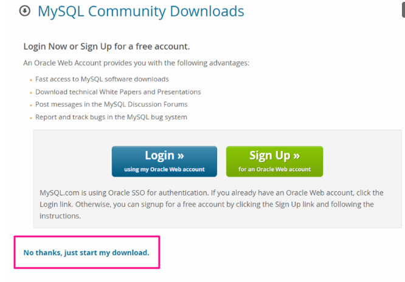
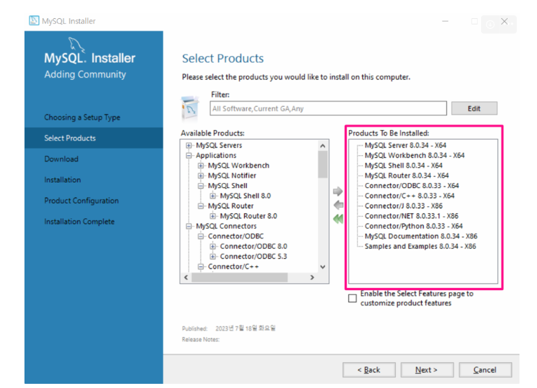
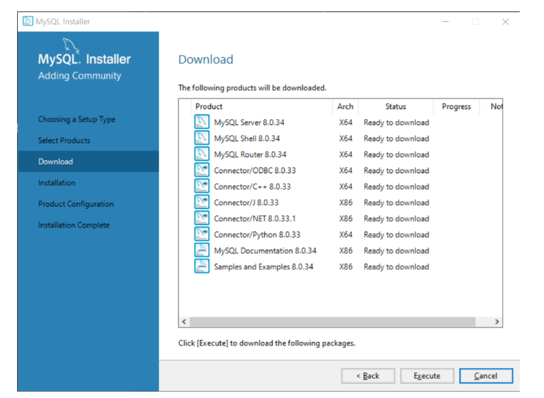
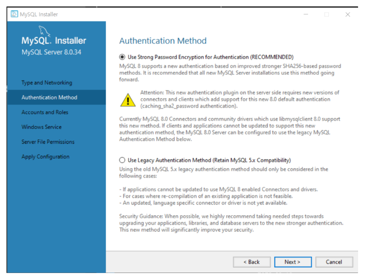
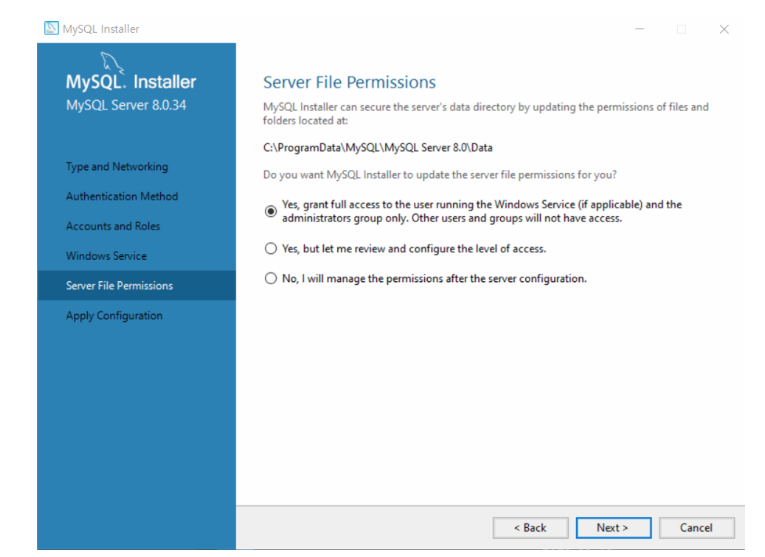
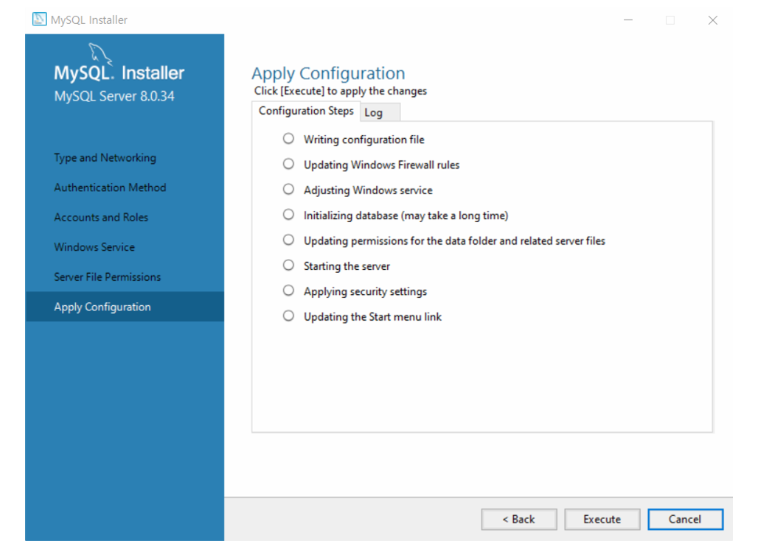
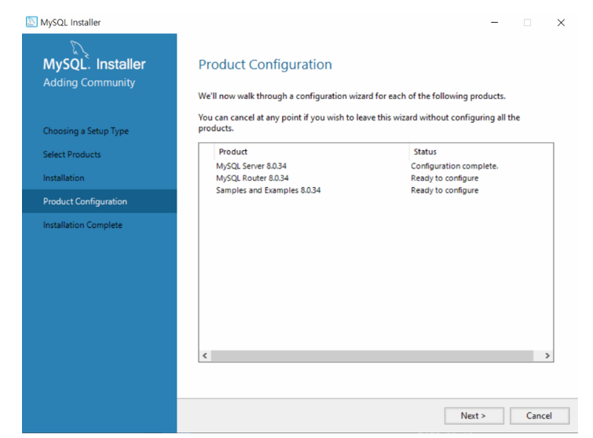
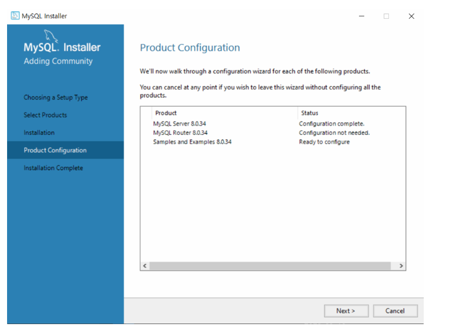
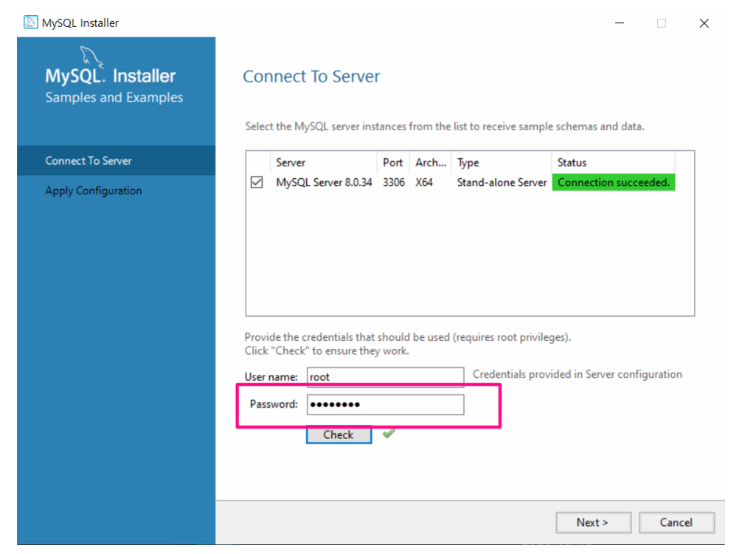
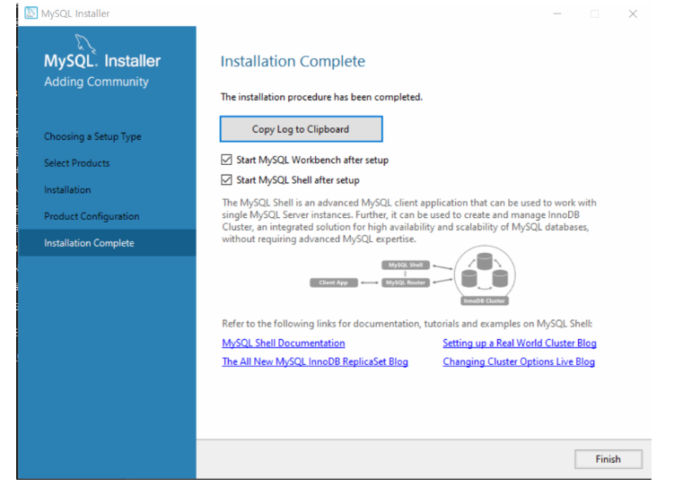

# 2.2 MySQL 설치

MySQL Community 설치

[MySQL 설치](https://dev.mysql.com/downloads/mysql/)

## MySQL 접속하기

### MySQL Workbench 8.0 CE

실행 후 MySQL Connections 클릭

SQL Additions 는 당분간 사용할 일이 없다.

중간의 Query 1, 왼쪽의 Navigator, 아래쪽의 Output만 사용

### MySQL Workbench 설정 확인하기

Updates문과 Delete문을 원활하게 사용하기 위해 Safe Updates 설정을 끈다.

### path 추가하기

MySQL의 실행파일이 있는 경로를 Path에 추가한다.

MySQL 파일 경로 : **C:\Program Files\MySQL\MySQL Server 8.0\bin** 

Windows Powershell_관리자모드 실행

해당 코드 실행 후 재부팅

